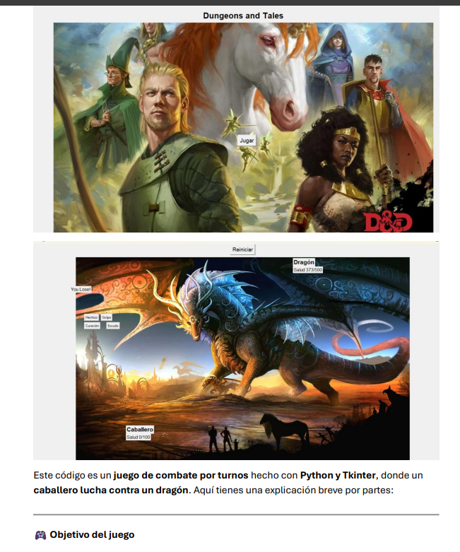

# 👋 ¡Hola! Soy Emanuel

Soy estudiante apasionado por el aprendizaje, especialmente cuando se trata de videojuegos, tecnología y todo lo creativo. Me gusta explorar ideas nuevas, crear cosas digitales y divertirme mientras aprendo.

> "La curiosidad y los videojuegos me impulsan a aprender cada día más."

---

## 🎯 Habilidades y Tecnologías

- Lenguajes: Python, HTML, C++ (en proceso de aprendizaje)
- Herramientas: VS Code, Git, Canva
- Intereses: Diseño de videojuegos, inteligencia artificial, mods

---

## 📊 Estadísticas de GitHub

---

## 📂 Proyectos destacados

### Mapa interactivo de videojuegos favoritos
Un proyecto en el que comparto mis juegos

---

## 📬 Contacto y Redes Sociales

- Correo: memmared2017@gmail.com
- Discord: temnmat
- Instagram: [@emanuel_dev](https://instagram.com/t_menma_t)

---

## 🎨 Cosas creativas y fun facts

- Me gustan los juegos con buena historia y gráficos únicos.
- Me gustaría en el futuro crear un videojuego indie.

---

Gracias por visitar mi perfil, ¡seguimos en contacto!
